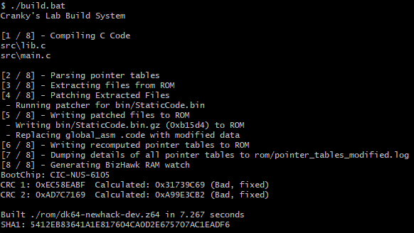

# Donkey Kong 64 Base Hack
> This repo contains all the necessary building blocks to make a Donkey Kong 64 ROM Hack.

To assist with ROM Hack making, this repo serves as a suggested base for developers to build off when making their own Donkey Kong 64 ROM Hacks.

Tools contained:
* Cranky's Lab: Enables overwriting ROM Assets without entropy restrictions
* ARMIPS: Writing custom code in C or MIPS Assembler
* N64Tex: Converting PNGs into image formats supported by the N64 (RGBA16, i4, i8, ia4, ia8)
* Flips: CLI for creating BPS Patches

## Building Pre-Requisites
* Python 3
* [n64chain](https://github.com/tj90241/n64chain/releases/tag/9.1.0)
## Build Setup (Windows)
1. Download n64chain-windows.zip from here
2. Extract to C:\n64chain
3. Add C:\n64chain\tools\bin to your system %path% environment variable
4. Install Python 3
5. Git clone (or download a zip + extract) this repo to somewhere convenient
6. Create a rom subdirectory in the root of the repo
7. Put dk64.z64 (SHA1: CF806FF2603640A748FCA5026DED28802F1F4A50) in the `rom` subdirectory
8. Run build.bat
9. Provided everything is working, the built ROM will appear in the `rom` subdirectory

## Contributing

1. Fork it (<https://github.com/theballaam96/dk64-hack-base/fork>)
2. Create your feature branch (`git checkout -b feature/fooBar`)
3. Commit your changes (`git commit -am 'Add some fooBar'`)
4. Push to the branch (`git push origin feature/fooBar`)
5. Create a new Pull Request

## Contributors
* [Isotarge](https://twitter.com/isotarge)
* [Ballaam](https://twitter.com/tjballaam)
* [GloriousLiar](https://twitter.com/gloriousliar)
* [Rain](https://twitter.com/rainchus)